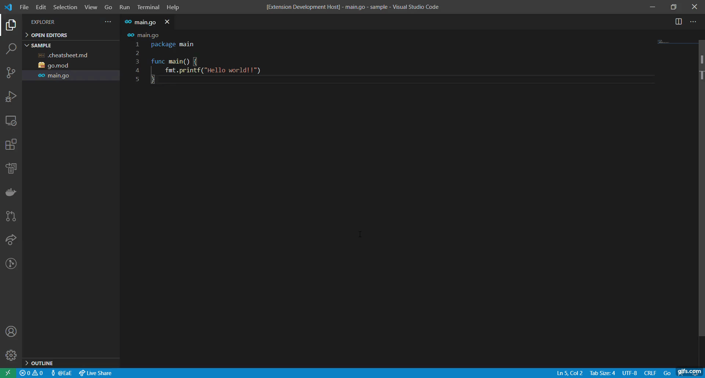

# MyCheatsheet for VS Code
VS Code extension that lets you open a your cheatsheet directly in the editor.

## Features
Create a `.cheatsheet.md` file in your workspace root.  
To open the cheatsheet press `Ctrl+Shift+P` (Win, Linux) / `Cmd+Shift+P` (Mac) and search for the `Show Cheatsheet` command.

## Demo
`Show Cheatsheet` command.
