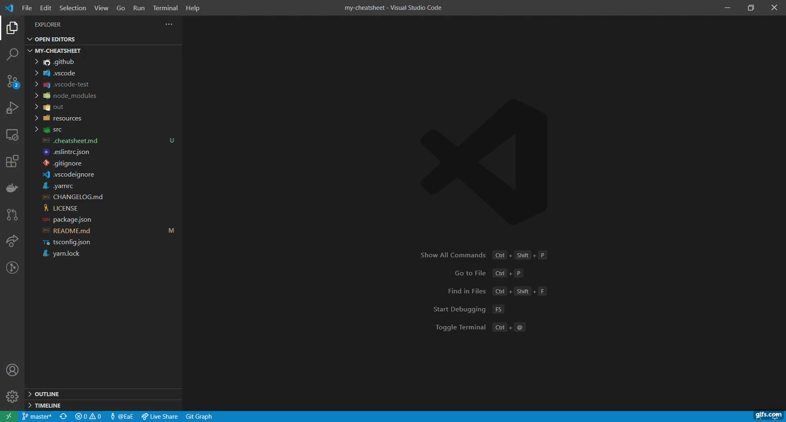

# MyCheatsheet for VS Code
VS Code extension that lets you open a your cheatsheet directly in the editor.  
You can easily create your own Cheatsheet.

## Features
Create  `.cheatsheet.md` file in the root of the workspace.   
Alternatively, put the `/.cheatsheets` directory in your home directory.  
Cheatsheet can be written using 'Markdown'.  
To open the cheatsheet press `Ctrl+Shift+P` (Win, Linux) / `Cmd+Shift+P` (Mac) and search for the `Show Cheatsheet` command.

## Demo
`Show Cheatsheet` command.
