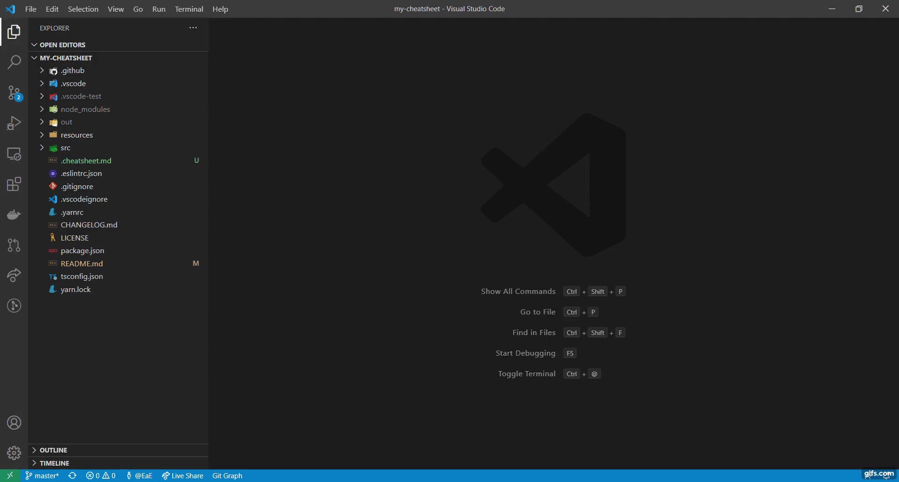

# Features
To open the cheatsheet press `Ctrl+Shift+P (Win, Linux)` / `Cmd+Shift+P (Mac)` and search for the `Show Cheatsheet` command.

## If a `.cheatsheet` file exists in your workspace
If there is a `.cheatsheet.md` file in the workspace, `Show cheatsheet` displays the 『.cheatsheet (workspace)』.


## If a `.cheatsheets` directory exists in your home
If you have a `.cheatsheets` directory in your home, you will be shown the alternatives depending on the contents of the directory.


In this case, the folder structure is as follows.

```sh
~/.cheatsheets
 |
 |-- golang
 |     |-- .cheatsheet.md
 |
 |-- typescript
       |-- .cheatsheet.md
```

## Demo
